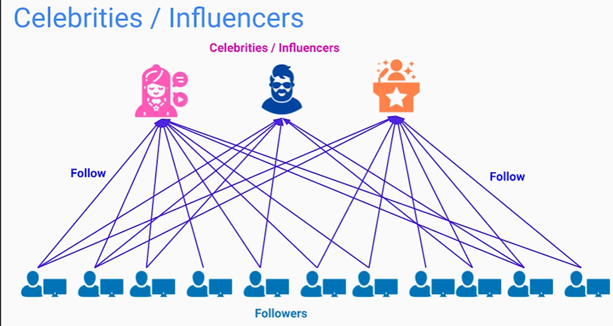

# introduction 
1. **Functional Requirements**
  

2. **NON - Functional Requirements**
  

3. **Defining System’s API & Sequence of Events**
  

4. **Designing for Functional Requirements**
  

5. **Addressing Non-Functional Requirements**
  

# Highly Scalable Image-Sharing Platform

1. **User service** :- the user service will be used for registeration and login service and the user information uipdation service. and the information will be stored in the database . it can be a document based database as the information about the user can be added in the future.

2. **Posts service** :- this will be used for posting the images by the user. we need to create a SQL database which stores the imgGE URL. SO THE image will be stored in the object store and the image url will be stored in the database.

3. **Search service** :- so this service is explicitely used for searching the user by their username/firstname/lastname. we need to make this service very fast and therefore we separated it from the users service. there will be a message broker between users and search service. whenever the user registers ir changes his information , the request is fulfilled by users service but it will also add a message to update the search service database in the message broker . so that both the database should be consisted with the users data. and this service will be faster as it is doing only 1 task.

4. **TimeLine service** :- this service will show the users the posts of the people they folled in the descending fasion of the time. means most recent posts will be up. to make this faster. we created. in its key-value pair database, the key will be the user and value will be the array of posts of the followers. if userA follws userB and userC , then database will be like this 

so there will be a message broker between posts and timeline service. whenever a userB will post the image then all the rows where where user follws userB will be updated and the image url will be added in front of the array.

5. Following can be handled by the users service by making another collection where the fields will be x --> y . x is the user which follws user y.

6. **WEB APP SERVICE** :- this is the frontend part. 

# Non- Functional requirements consruction.

## Scalability
1. For scaling **web app service** only multiple instances of it and their should be a load balancer to distribute the load among multiple instances.

2. similarly each and evey service should have multiple instances and load balancer in front of it. 

3. All the databases can be sharded on the basis of a hash function. each row will have a unique id which should be hashed and whatever the bvalue comes it will go in that shard. for example :- if the id is 44 . on hashing 44 we get 3 and we have didiveded our database in 5 parts . then the row with hash 3 will go to 3rd shard. 

4. we can introduce a Image processing layer in front of objject store so that whatever high defination images being given by the iuser can be compressed and then stored in the object store.

5. There should be a API gateway in fornt of all then backedn services. so that the frontend only needs to contact API gatway and not individaula IP addresses of the service / load balnacer. 

## Availability
1. we should do replication of the databaseses. so that multiple replicas cane there. if some data is loosed by one replica. another should be there. 
2. we should keep replicas in another country servers as well. if any thing happend in that country . our data should be still secured.
 
3. as we know that posts have a larger read operations rather than write operatiokns therefore we can make the write on the primary node and read on the secondary node. this is parent - child relationship. 

## Performance 
1. to increase the performance we need to decr3eae the loading time of the iamges. and therefore we should iuntroduce a  **CDN** , so that it could serve the images fast.
2. Now there can be celebrity in the users and they qare follwed by a large number of people. as we have designed the dataabse of the ltimeline in a way of key value pair. so if there are many follwers of a celebrity then we need to change a lot of rows. there fore it becomes a very heavy operation.  
 
 
**Solution** :- the solution is to separate the celerities and normalusers on the basis o the threshold. lets say the threshold is 10M . so we will make another key value databse for celerities where key will be the celeberity and value will be the sorted list of posts. so if any user asks for thentime of celebrities then only this key value pair batabase should be read. the timeline service will be merging it with all the recent posts and then serving the user.
 
 
